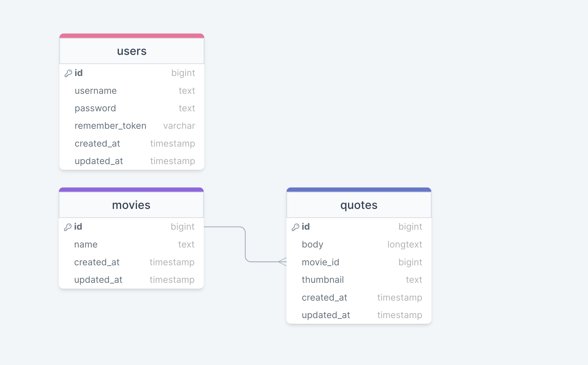

## Movie quotes

Movie quotes is a website where you can see quotes from different movies. 
In landing page there is a quote from a random movie. 
With click on the movie name we can see all the available quotes from the same movie.


## Table of Contents

* [Prerequisites](#prerequisites)
* [Tech Stack](#tech-stack)
* [Getting Started](#getting-started)
* [Migrations](#migration)
* [Database Structure](#project-structure)


### Prerequisites
* PHP@8.1 and up
* MYSQL@8 and up
* Composer@2.5.5
* npm@8.19.2


### Tech Stack

* [laravel@10.x ](https://laravel.com/docs/10.x)
* [Spatie Translatable](https://github.com/spatie/laravel-translatable)

## Getting Started

1. First of all you need to clone repository from github:
```sh
git clone https://github.com/RedberryInternship/zezva-okhanashvili-movie-quotes.git
```
2. Next step requires you to run *composer install* in order to install all the dependencies.
```sh
composer install
```

3. after you have installed all the PHP dependencies, it's time to install all the JS dependencies:
```sh
npm install
```

and also:
```sh
npm run dev
```
in order to build your JS/SaaS resources.

4\. Now we need to set our env file. Go to the root of your project and execute this command.
```sh
cp .env.example .env
```
And now you should provide **.env** file all the necessary environment variables:

#
**MYSQL:**
>DB_CONNECTION=mysql

>DB_HOST=127.0.0.1

>DB_PORT=3306

>DB_DATABASE=*****

>DB_USERNAME=*****

>DB_PASSWORD=*****


#
**MAILGUN:**
>MAILGUN_DOMAIN=******

>MAILGUN_SECRET=******

#
**Georgian Card:**
>MERCHANT_ID=******

>PAGE_ID=******

>ACCOUNT_ID=******

>BACK_URL_S=******

>BACK_URL_F=******

>REFUND_API_PASS=******

>CCY=******

#
**Twilio:**
>TWILIO_SID=******

>TWILIO_TOKEN=******

>TWILIO_FROM=******

#
**Maradit:**
>MARADIT_HTTPS=true

>MARADIT_USERNAME=******

>MARADIT_PASSWORD=******

#
**Google Cloud Messaging:**
>FCM_SERVER_KEY=******

>FCM_SENDER_ID=******

after setting up **.env** file, execute:
```sh
php artisan config:cache
```
in order to cache environment variables.


4. Now execute in the root of you project following:
```sh
  php artisan key:generate
```
Which generates auth key.

##### Now, you should be good to go!


#
### Migration
if you've completed getting started section, then migrating database if fairly simple process, just execute:
```sh
php artisan migrate
```


## Database structure

 

[diagram link](https://drawsql.app/teams/zeizvant/diagrams/movie-quotes)

